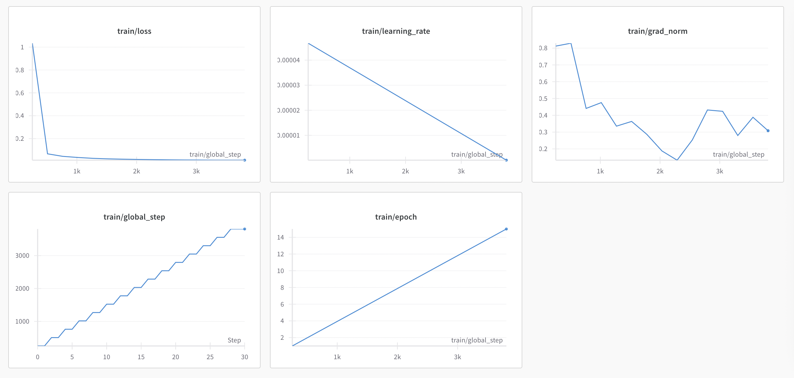

## Sections  
- [Description](#description)  
- [Quickstart](#quick-start)
- [Objective](#objective)  
- [Process](#processs)  

<a name="description"></a>
## Description 
Fine-Tune a sequence-to-sequence model for Natural Language translation to MongoDB Query 


<a name="quick-start"></a>
## Quickstart
1. Download the model I trained and uploaded on Hugging Face [here](https://huggingface.co/paulc1212/paulc1212-nl-query-2-mongo-query-t5-small) or can fine-tune yours by following the Jupyter Notebook steps [here](ml/Fine%20tune%20T5%20for%20NLQ%20to%20MLQ.ipynb).  
   Or load the model directly from Hugging Face by tweaking step 4 below (last paragraph)
2. Create .env file in the root directory and add the following variables:
    ```bash
    MONGO_INITDB_ROOT_USERNAME=admin
    MONGO_INITDB_ROOT_PASSWORD= #mention some random password
    MONGO_INITDB_DATABASE=user-bookings
    MONGO_HOST_PORT=27017

    # path to the model downloaded from Hugging Face or your own trained model, I've put mine in the ml folder
    MODEL_PATH="ml/paulc1212-nl-query-2-mongo-query-t5-small" 
    SCHEMA_FILE="ml/database_schema.txt"
    MODEL_PREFIX="translate Natural Language to MongoDB Query: "
    TORCH_DEVICE="mps" #cuda - if using GPU, mps - if using Macbook with Apple silicon chip, cpu - if using CPU
    ```
3. Bring mongodb up with docker
    ```bash
    docker-compose up -d
    ```
4. Run the python inferce api by running `start_python_inference_api.sh` script
    ```bash
    ./start_python_inference_api.sh
    ```
   The inference api is set to run on port `9990` but can be changed inside `start_python_inference_api.sh` script (line `8`)
<a name="inference-api"></a>
5. Run the web application by running `start_web_app.sh` script
    ```bash
    PORT="9990" #this line
    ```
   The python_inference_api can be [tweaked](https://huggingface.co/paulc1212/paulc1212-nl-query-2-mongo-query-t5-small?library=transformers) to load the model directly from HF.  
   Can use the debug [notebook](debug/debug.ipynb) tool (`Debug python_inference_api`) to check that the inference API is up and running

<a name="objective"></a>
## Objective
Develop a system capable of translating natural language queries (NLQ) into MongoDB queries (MLQ) by fine-tuning a sequence-to-sequence model on a dataset of NLQ and MLQ pairs. The system should be capable of understanding, generating and executing MongoDB queries based on user input in natural language. The output should be viewable in a web application, allowing users to input their queries (NLQ) and receive the executed MongoDB query results in a user-friendly format.  

<a name="processs"></a>
## Processs
1. **Problem definition**  
Explore the problem of translating natural language into MongoDB queries by fine-tunning a model on a dataset built based on an existing [MongoDB database](mongo_db). Initial focus is on simple `find` queries for specific db collections (`users`, `bookings`).  

2. **Model Selection**    
Initially chose the 80M params [FLAN-T5-small](https://huggingface.co/google/flan-t5-small) model however during inference is was generating incorrect outputs, due to ommitting some symbols (see Data Preparation -> linear format).  
***Research paper for Flan**: https://arxiv.org/pdf/2210.11416*  
Finally chose the 60M params [T5-small](https://huggingface.co/google-t5/t5-small) model due to doing better at input -> target text generation. And the target text is a MongoDB query in linear format (more below about the linear format).  
***Research paper for T5**: https://jmlr.org/papers/volume21/20-074/20-074.pdf*  
The reason for chosing a small model is because is more suitable for experimentation and it's suitable for resources (GPU) constraints. A larger model might perform much better at inference after fine-tuning however that would require a paid Google Colab plan or a powerful GPU.

3. **Data Preparation**  
    - The initial MongoDB query (MLQ) targets structure was defined in json format as
        ```json
        {
            "c":"users", 
            "op":"find", 
            "q": { 
                "country": "Canada",
                "stats.totalCreditsBought": {
                    "$gt": 1000.0
                }
            }
        }
        ```
        where
        | Field  | Description |
        | ------------- | ------------- |
        | c  | collection name |
        | op  | operation type - for not focus only on find |
        | q  | query filter (json object) |  

        However, the nested JSON structure proved to be troublesome for the model to learn. Especially because the model tokenizer was representing the curly brackets `{}` as `<unk>` tokens.
    - Solution: Instead of JSON structure adopt a novel linearized (flattened) format using distinct markers to represent symbols e.g.  

        | Symbol  | Marker |
        | ------------- | ------------- |
        | {  | LCB  |
        | }  | RCB  |
        | [  | LB   |
        | ]  | RB   |
        | :  | =    |
        | ,  | use `&` for query filters and use `;` for instructions separations `c,op,q`  |
        | &  | OP_ |
        So the above example would be represented as:
        ```
        c=users; op=find; q=LCB country=Canada & stats.totalCreditsBought= LCB OP_$gt=1000.0 RCB RCB
        ```
    - The created [dataset](ml/nlq2mlq_find_op_data_1138_linearized.json) 1000+ examples of NLQ and MLQ pairs focusing only on `find` operations
    - In the [dataset](ml/nlq2mlq_find_op_data_1138_linearized.json) were included various mongodb queries with filters like equality, numeric comparisons(`&gt`,`&lt`), set comparisons (`$in`) and last but not least multi-condition queries. 

4. **Fine-tuneing the model**  
- I've created a [notebook](ml/Fine%20tune%20T5%20for%20NLQ%20to%20MLQ.ipynb) that I used to fine-tune the model and can be used on Google Colab 
- Summary: 
    - Utilized Google Colab (free plan) with GPU acceleration to fine-tune the model.
    - Utilized the **Hugging Face's** [transformers](https://github.com/huggingface/transformers) for fine-tuning an [datasets](https://github.com/huggingface/datasets) for process and prepare data for training.
    - Injected the [database schema](ml/database_schema.txt) to resolve ambiguity and provide more context so the model can learn and understand better context
- Results:
    - The model was trained for 15 epochs with a learning rate of 5e-05
    - Training results:  
        | Training Loss | 	Epoch Step | 	Validation | Loss |
        | ------------- | ------------- | ------------- | ------------- |
        | 1.0341 | 	1.0 | 	254 | 	0.0508 |
        | 0.067 | 	2.0 | 	508 | 	0.0295 |
        | 0.045 | 	3.0 | 	762 | 	0.0214 |
        | 0.035 | 	4.0 | 	1016 | 	0.0149 |
        | 0.0275 | 	5.0 | 	1270 | 	0.0116 |
        | 0.0229 | 	6.0 | 	1524 | 	0.0094 |
        | 0.0201 | 	7.0 | 	1778 | 	0.0081 |
        | 0.0178 | 	8.0 | 	2032 | 	0.0067 |
        | 0.016 | 	9.0 | 	2286 | 	0.0060 |
        | 0.0143 | 	10.0 | 	2540 | 	0.0054 |
        | 0.0132 | 	11.0 | 	2794 | 	0.0048 |
        | 0.0127 | 	12.0 | 	3048 | 	0.0045 |
        | 0.0114 | 	13.0 | 	3302 | 	0.0041 |
        | 0.0113 | 	14.0 | 	3556 | 	0.0040 |
        | 0.0115 | 	15.0 | 	3810 | 	0.0039 |
    - Wandb training metrics
      
    - The final trained [model](https://huggingface.co/paulc1212/paulc1212-nl-query-2-mongo-query-t5-small) was uploaded to Hugging Face 
    

